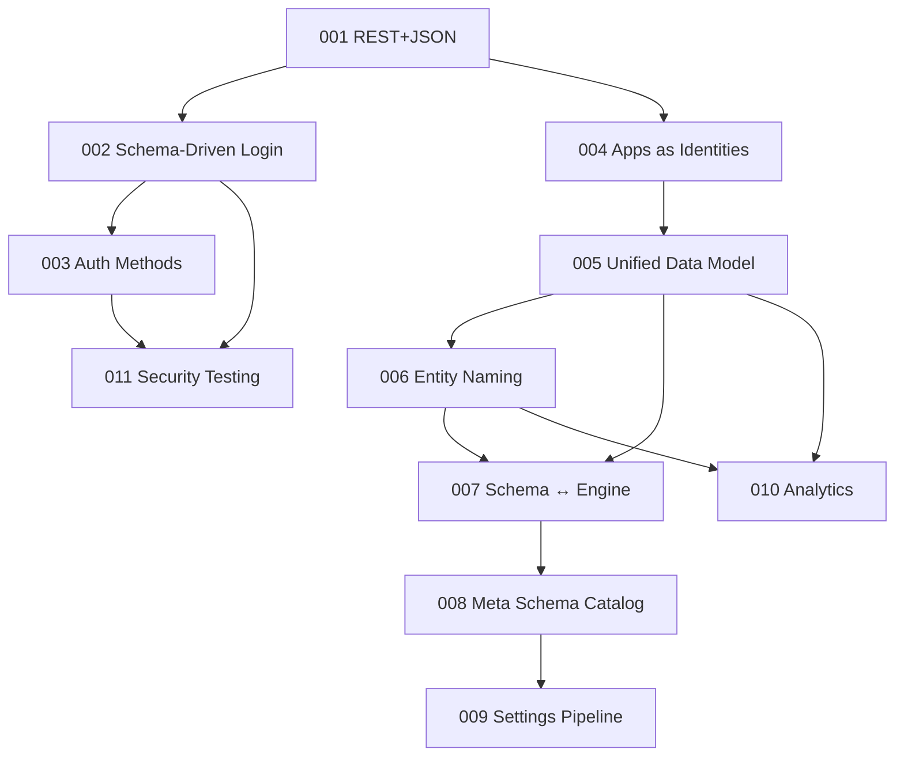

# Architecture & Design Thinking

> **Note:** This is an R&D prototype. APIs, schemas, and architectures are experimental and subject to breaking changes.
>
> These are living documents — architecture decisions, design thinking, and vision. Not customer documentation.
> Start with [ARCHITECTURE.md](architecture/overview.md) for an overview of everything here. Check [GLOSSARY.md](GLOSSARY.md) for terminology.

## Architecture Decision Records

| # | Title | Status | Date |
|---|---|---|---|
| [001](001-rest-over-connectrpc.md) | REST+JSON over ConnectRPC | Accepted | 2026-03-26 |
| [002](002-schema-driven-login.md) | Schema-Driven Identity, Auth, and Login Flows | Accepted | 2026-03-26 |
| [003](003-auth-methods-meta-schema.md) | Unified Auth Methods and Meta-Schema Validation | Accepted | 2026-03-26 |
| [004](004-apps-as-identities-oidc.md) | Apps as Identities — OIDC Provider | Proposed | 2026-03-27 |
| [005](005-unified-data-model.md) | Unified Data Model — Schemas, Orgs, Config Cascade | Accepted | 2026-03-27 |
| [006](006-entity-naming-model.md) | Entity Naming Model — Schema-as-Ontology | Proposed | 2026-03-27 |
| [007](007-schema-engine-interaction.md) | Schema ↔ Engine Interaction Model | Proposed | 2026-03-27 |
| [008](008-meta-schema-catalog.md) | Meta Schema as Entity Catalog | Proposed | 2026-03-27 |
| [009](009-settings-engine-pipeline.md) | Hierarchical Settings & Engine Pipeline | Proposed | 2026-03-27 |
| [010](010-analytics-two-tier.md) | Identity Observability — Three Domains & Two Data Paths | Proposed | 2026-03-27 |
| [011](011-security-testing-philosophy.md) | Security Testing Philosophy — OWASP-Grounded | Accepted | 2026-03-27 |

## Architecture

| Document | Summary |
|---|---|
| [System Overview](architecture/overview.md) | System diagram, three domains, request pipeline, deployment topologies |
| [Event Pipeline](architecture/event-pipeline.md) | Events table as queue, async consumers, backpressure, OTEL export |

## Design

| Document | Summary |
|---|---|
| [Developer Experience](design/developer-experience.md) | Zero-config, pure Go binary, config cascade, testing philosophy |
| [Design Decisions](design/design-decisions.md) | Resolved architecture and product decisions with rationale |
| [Design Patterns](design/design-patterns.md) | Unified identity, i18n, notifications, schemas, UI architecture |

## Vision

| Document | Summary |
|---|---|
| [Market Positioning](vision/positioning.md) | Three pillars, landscape analysis, target audiences |
| [Pricing Philosophy](vision/pricing-philosophy.md) | Open core model, consumption-based design thinking |

## Dependency Graph

## Conventions

- **ADR filename**: `NNN-slug.md` (zero-padded 3-digit number)
- **ADR header**: `# ADR-NNN: Title` + Status / Date / Builds on / Supersedes
- **ADR status**: `Proposed` → `Accepted` → `Superseded`
- **Next ADR number**: 012
