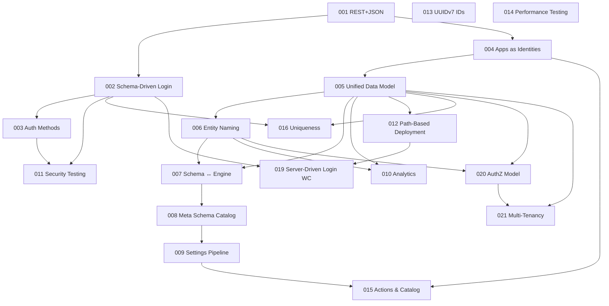

# Architecture & Design Thinking

> **Note:** This is an R&D prototype. APIs, schemas, and architectures are experimental and subject to breaking changes.
>
> These are living documents — architecture decisions, design thinking, and vision. Not customer documentation.
> Start with [ARCHITECTURE.md](architecture/overview.md) for an overview of everything here. Check [GLOSSARY.md](GLOSSARY.md) for terminology.

## Architecture Decision Records

| # | Title | Status | Date |
|---|---|---|---|
| [001](adr/001-rest-over-connectrpc.md) | REST+JSON over ConnectRPC | Accepted | 2026-03-26 |
| [002](adr/002-schema-driven-login.md) | Schema-Driven Identity, Auth, and Login Flows | Accepted | 2026-03-26 |
| [003](adr/003-auth-methods-meta-schema.md) | Unified Auth Methods and Meta-Schema Validation | Accepted | 2026-03-26 |
| [004](adr/004-apps-as-identities-oidc.md) | Apps as Identities — OIDC Provider | Proposed | 2026-03-27 |
| [005](adr/005-unified-data-model.md) | Unified Data Model — Schemas, Orgs, Config Cascade | Accepted | 2026-03-27 |
| [006](adr/006-entity-naming-model.md) | Entity Naming Model — Schema-as-Ontology | Proposed | 2026-03-27 |
| [007](adr/007-schema-engine-interaction.md) | Schema ↔ Engine Interaction Model | Proposed | 2026-03-27 |
| [008](adr/008-meta-schema-catalog.md) | Meta Schema as Entity Catalog | Proposed | 2026-03-27 |
| [009](adr/009-settings-engine-pipeline.md) | Hierarchical Settings & Engine Pipeline | Proposed | 2026-03-27 |
| [010](adr/010-three-tier-data.md) | Three-Tier Data Architecture | Accepted | 2026-03-28 |
| [011](adr/011-security-testing-philosophy.md) | Security Testing Philosophy — OWASP-Grounded | Accepted | 2026-03-27 |
| [012](adr/012-path-based-deployment.md) | Path-Based Deployment Architecture | Accepted | 2026-03-28 |
| [013](adr/013-id-generation-strategy.md) | ID Generation — Replace Sonyflake with UUIDv7 | Proposed | 2026-03-28 |
| 014 | Performance Testing Strategy — vCPU Scaling | Proposed | 2026-03-28 |
| [015](adr/015-actions-catalog.md) | Actions, Templates & Catalog | Proposed | 2026-03-28 |
| [016](adr/016-uniqueness-constraints.md) | Schema-Driven Uniqueness & Identifier Resolution | Proposed | 2026-03-28 |
| [017](adr/017-caching-tiers.md) | Process Cache Semantics | Proposed | 2026-03-28 |
| [018](adr/018-startup-lifecycle.md) | Startup Lifecycle & Schema Migration | Proposed | 2026-03-28 |
| [019](adr/019-server-driven-login-wc.md) | Server-Driven Login UI + Web Components | Accepted | 2026-03-28 |
| [020](adr/020-authorization-model.md) | Authorization Model — Immutable Core + Marketplace Modules | Accepted | 2026-03-29 |
| [021](adr/021-login-flow-schema.md) | Login Flow Schema — Composable Bot Detection & Behavioral Telemetry | Accepted | 2026-03-29 |
| [021](adr/021-multi-tenancy.md) | Multi-Tenancy via Instance Isolation | Accepted | 2026-03-30 |
| [022](adr/022-dedicated-resource-tables.md) | Dedicated Resource Tables + Metadata Extensions | Proposed | 2026-03-30 |
| [022](adr/022-provider-catalog-schema-binding.md) | Provider Catalog, Schema Binding, and Session Provenance | Accepted | 2026-03-30 |
| [023](adr/023-wide-events.md) | Wide Events as Internal Observability Primitive | Accepted | 2026-03-29 |
| [024](adr/024-risk-evaluation-policy-consumers.md) | Risk Evaluation and Policy Consumers | Accepted | 2026-03-30 |
| [025](adr/025-explicit-bootstrap-and-local-recovery.md) | Explicit Bootstrap and Local Break-Glass Recovery | Proposed | 2026-03-31 |
| [026](adr/026-cloud-container-per-tenant.md) | Cloud Deployment — Container-per-Tenant with D1 | Proposed | 2026-03-31 |
| [027](adr/027-fips-compliance.md) | FIPS Compliance — Opt-in Compile Target | Proposed | 2026-04-02 |
| [028](adr/028-secrets-hashers-key-lifecycle.md) | Configurable Secrets, Hashers & Key Lifecycle | Proposed | 2026-04-02 |

## Architecture

| Document | Summary |
|---|---|
| [System Overview](architecture/overview.md) | System diagram, three domains, request pipeline, deployment topologies |
| [Event Pipeline](architecture/event-pipeline.md) | Events table as queue, async consumers, backpressure, OTEL export |

## Design

| Document | Summary |
|---|---|
| [Developer Experience](design/developer-experience.md) | Zero-config, Rust-first single binary, config cascade, testing philosophy |
| [Design Decisions](design/design-decisions.md) | Resolved architecture and product decisions with rationale |
| [Design Patterns](design/design-patterns.md) | Unified identity, i18n, notifications, schemas, UI architecture |
| [Storage Architecture](design/storage-architecture.md) | Canonical storage role model (`storage.stateful`, `read`, `kv`, `sink`, `process_cache`, `analytics`) with derived SQLite/Postgres defaults and advanced split-topology overrides. |
| [Storage Implementation Status](design/storage-implementation-status.md) | Reality check for the current POC: what storage tiers are actually implemented, tested, and still only documented as target architecture. |

## Guides

| Document | Summary |
|---|---|
| [Local Development](guides/local-development.md) | Canonical `make dev` flow, role-specific commands, seed packs, local SQLite lifecycle |
| [Bootstrap and Recovery](guides/bootstrap-recovery.md) | Current Rust bootstrap flow and recovery limitations |
| [OIDC Daily Coverage](guides/oidc-conformance.md) | Daily OIDC provider conformance and RP regression targets via top-level `make` commands |
| [Secrets & Crypto](guides/secrets-and-crypto.md) | Password hashing, encryption keys, token config, secret generators, FIPS |
| [Zitadel Login Web Component](guides/zitadel-login-wc.md) | Embed and customize the server-driven login web component |

## Vision

| Document | Summary |
|---|---|
| [Market Positioning](vision/positioning.md) | Three pillars, landscape analysis, target audiences |
| [Pricing Philosophy](vision/pricing-philosophy.md) | Open core model, consumption-based design thinking |

## Dependency Graph

## Conventions

- **ADR location**: All ADRs live in `docs/adr/`
- **ADR filename**: `NNN-slug.md` (zero-padded 3-digit number)
- **ADR header**: `# ADR-NNN: Title` + Status / Date / Builds on / Supersedes
- **ADR status**: `Proposed` → `Accepted` → `Superseded`
- **Next ADR number**: 029
