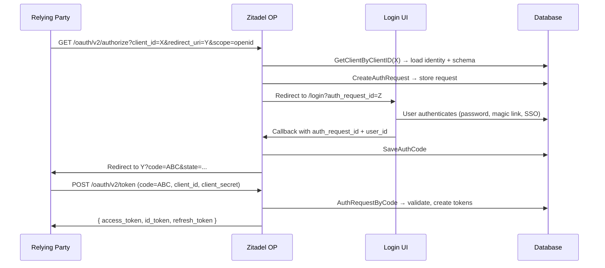

# ADR-004: Apps as Identities — OIDC Provider via `zitadel/oidc`

**Status**: Proposed  
**Date**: 2026-03-27  
**Supersedes**: N/A (new capability)

## Context

Zitadel needs to be an **OpenID Provider (OP)** — issuing ID tokens and access tokens to relying parties. The old Zitadel used a Projects → Apps hierarchy, but our schema-driven model offers a simpler, more powerful approach: **apps ARE identities**.

## Decision

### 1. Apps = Identities with OIDC/SAML schemas

An OIDC client (app) is an identity whose schema declares `x-oidc` configuration:

```json
{
  "type": "object",
  "x-auth-methods": {
    "client_secret": { "enabled": true, "interactive": false }
  },
  "x-oidc": {
    "grant_types": ["authorization_code", "client_credentials"],
    "response_types": ["code"],
    "token_endpoint_auth_method": "client_secret_post",
    "id_token_signed_response_alg": "RS256"
  },
  "properties": {
    "redirect_uris": { "type": "array", "items": { "type": "string", "format": "uri" } },
    "post_logout_redirect_uris": { "type": "array" },
    "client_name": { "type": "string" },
    "logo_uri": { "type": "string", "format": "uri" }
  },
  "required": ["redirect_uris", "client_name"]
}
```

| OIDC Concept | Maps To |
|---|---|
| `client_id` | `identities.identifier` |
| `client_secret` | `identity_credentials` (type=`client_secret`, bcrypt hash) |
| `redirect_uris` | `identities.data.redirect_uris` (validated by schema) |
| `grant_types` | Schema `x-oidc.grant_types` |
| `client_name` | `identities.data.client_name` |

### 2. No Projects — Apps Stand Alone

Projects were a container that added complexity without value. Apps are first-class identities. Group them by org if needed, or add tags/labels later.

### 3. OIDC Provider via `zitadel/oidc` v3

We implement `op.Storage` backed by our existing tables:

| Storage Method | Backed By |
|---|---|
| `GetClientByClientID` | `identities` + `schemas` (lookup by identifier, read `x-oidc` from schema) |
| `AuthorizeClientIDSecret` | `identity_credentials` (bcrypt verify) |
| `CreateAuthRequest` | New `oidc_auth_requests` table |
| `AuthRequestByID/Code` | `oidc_auth_requests` |
| `CreateAccessToken` | `oidc_tokens` table |
| `CreateAccessAndRefreshTokens` | `oidc_tokens` + `oidc_refresh_tokens` |
| `SigningKey / KeySet` | RSA key generated on first boot, stored in `oidc_signing_keys` |
| `SetUserinfoFromRequest/Token` | `identities.data` (schema-driven user claims) |
| `ClientCredentialsTokenRequest` | `identity_credentials` (the app authenticates as itself) |

### 4. New Database Tables

```sql
-- OIDC auth requests (ephemeral, deleted after token exchange)
CREATE TABLE IF NOT EXISTS oidc_auth_requests (
    id           TEXT PRIMARY KEY,
    client_id    TEXT NOT NULL,
    redirect_uri TEXT NOT NULL,
    scopes       TEXT NOT NULL DEFAULT '',
    state        TEXT DEFAULT '',
    nonce        TEXT DEFAULT '',
    response_type TEXT DEFAULT 'code',
    code_challenge TEXT DEFAULT '',
    code_challenge_method TEXT DEFAULT '',
    user_id      INTEGER DEFAULT 0,
    auth_time    TEXT,
    done         INTEGER DEFAULT 0,
    code         TEXT DEFAULT '',
    created_at   TEXT NOT NULL DEFAULT (datetime('now'))
);

-- OIDC authorization codes
CREATE TABLE IF NOT EXISTS oidc_codes (
    code       TEXT PRIMARY KEY,
    request_id TEXT NOT NULL,
    created_at TEXT NOT NULL DEFAULT (datetime('now'))
);

-- OIDC tokens (opaque access tokens)
CREATE TABLE IF NOT EXISTS oidc_tokens (
    id              TEXT PRIMARY KEY,
    application_id  TEXT NOT NULL,
    subject         TEXT NOT NULL,
    audience        TEXT NOT NULL DEFAULT '',
    scopes          TEXT NOT NULL DEFAULT '',
    refresh_token_id TEXT DEFAULT '',
    expiration      TEXT NOT NULL,
    created_at      TEXT NOT NULL DEFAULT (datetime('now'))
);

-- OIDC refresh tokens
CREATE TABLE IF NOT EXISTS oidc_refresh_tokens (
    id             TEXT PRIMARY KEY,
    token          TEXT NOT NULL,
    application_id TEXT NOT NULL,
    user_id        TEXT NOT NULL,
    audience       TEXT NOT NULL DEFAULT '',
    scopes         TEXT NOT NULL DEFAULT '',
    auth_time      TEXT NOT NULL,
    amr            TEXT DEFAULT '',
    access_token   TEXT NOT NULL,
    expiration     TEXT NOT NULL
);

-- OIDC signing keys
CREATE TABLE IF NOT EXISTS oidc_signing_keys (
    id          TEXT PRIMARY KEY,
    algorithm   TEXT NOT NULL DEFAULT 'RS256',
    private_key BLOB NOT NULL,
    created_at  TEXT NOT NULL DEFAULT (datetime('now'))
);
```

### 5. Integration with Existing Login Flow

The authorization code flow works like this:



### 6. Console UX

```
Navigation:
├── Dashboard
├── Identities          (schema type filter chips)
├── Applications        (same API, filtered by x-oidc/x-saml schemas)
│   ├── OIDC Clients
│   └── SAML SPs
├── Providers
├── Schemas
└── Events
```

"Applications" is a UX-only grouping — the API is `GET /v1/identities?has_annotation=x-oidc`.

## Consequences

- **Unified model**: Apps, users, service accounts — all identities with different schemas
- **Schema-validated**: OIDC config validated at write time via JSON Schema
- **Extensible**: SAML, SCIM, or custom protocols just need new `x-*` annotations
- **Standard compliant**: Full OIDC Core via `zitadel/oidc` library
- **Migration path**: Old Zitadel apps can be imported as identities with `oidc_client` schemas
