# ADR-010: Identity Observability — Three Domains & Two Data Paths

**Status**: Proposed  
**Date**: 2026-03-27  
**Builds on**: ADR-005 (Unified Data Model), ADR-006 (Entity Naming)  
**Related**: [Pillar 3: Identity Intelligence](../../positioning.md), [adrs.md ADR-007 (OTEL)](../../adrs.md)  
**Supersedes**: Embedded DuckDB, Parquet lake_writer (both removed)

## Context

Zitadel is an identity platform that serves three distinct domains. Each has different data requirements, query patterns, and latency constraints. This ADR defines how data flows across these domains and clarifies two separate data paths: **Identity Observability** (Zitadel owns the data) and **OTEL Export** (fire-and-forget).

## The Three Domains

```mermaid
graph LR
    subgraph Transactional["🔒 Transactional (OLTP)"]
        T1["Create/update/delete users"]
        T2["Authenticate (password, passkey, SSO)"]
        T3["Authorize (FGA checks)"]
        T4["Issue/revoke tokens"]
        T5["Manage orgs, schemas, policies"]
    end

    subgraph Analytical["📊 Analytical (Identity Observability)"]
        A1["How many users? What can they do?"]
        A2["What did user X do? (audit trail)"]
        A3["What was accessed? (access trail)"]
        A4["Login trends by method, org, geo"]
        A5["Agent activity traces"]
        A6["SDK telemetry (what was user X shown?)"]
    end

    subgraph Intelligence["🧠 Intelligence (Threat + Automation)"]
        I1["Anomaly detection (credential stuffing)"]
        I2["Alerting (alert = event)"]
        I3["Automated response (rate limit, revoke, kill)"]
        I4["LLM/SLM forensics ('What did Agent X do?')"]
        I5["Shadow mode (evaluate without blocking)"]
    end

    Transactional -->|"events"| Analytical
    Analytical -->|"signals"| Intelligence
    Intelligence -->|"actions (also events)"| Transactional
```



| Domain | Purpose | Latency | Data |
|---|---|---|---|
| **Transactional** | CRUD, auth, authz | <10ms | Entities, sessions, events (OLTP) |
| **Analytical** | Aggregation, audit, traces, exploration | <1s | Events, SDK telemetry, aggregations |
| **Intelligence** | Detection, alerting, automated response | Async | Events → rules → alerts → actions |

> [!IMPORTANT]
> Intelligence outputs (alerts, automated rate limits, session revocations) are **also events** — they flow back into the Analytical domain and can trigger further Intelligence rules. This creates a closed feedback loop.

## Two Data Paths

### Path 1: Identity Observability (Zitadel reads this)

Zitadel **owns** this data. It stores events, queries them, aggregates them, shows them in the Console, feeds them to the Intelligence engine, and traces identity flows.

```
                              ┌──────────────────────┐
Mutations (entity.*, schema.*)│                      │
  ──────────────────────────→ │   Analytics Backend   │ ← Console SQL editor
OTLP ingestion (SDK telemetry)│   (OLTP or dedicated) │ ← Dashboard aggregations
  ──────────────────────────→ │                      │ ← Audit trail queries
Intelligence actions (alerts) │                      │ ← LLM forensics
  ──────────────────────────→ │                      │ ← Threat rule evaluation
                              └──────────────────────┘
```

**What Zitadel uses this data for:**

| Use Case | Query Pattern |
|---|---|
| "How many users in org X?" | `SELECT COUNT(*) FROM entities WHERE schema_id = 'human_user_v1'` |
| "What can user Y do?" | `SELECT * FROM entities WHERE id = Y` + FGA check |
| "What did user Y do?" | `SELECT * FROM events WHERE actor_id = Y ORDER BY created_at` |
| "What was accessed?" | SDK telemetry via OTLP → events table |
| "Login trends this week" | `SELECT date_trunc('hour', created_at), COUNT(*) FROM events WHERE event_type LIKE 'auth.%' GROUP BY 1` |
| "Trace: What happened in order?" | `SELECT * FROM events WHERE session_id = S ORDER BY created_at` |
| "Alert: 50 failed logins from one IP" | Threat engine evaluates rules → emits `threat.detected` event |
| "LLM: What did Agent X do yesterday?" | Forensics endpoint queries events → LLM prompt |

**The Analytics Backend** defaults to querying the same OLTP database. For larger deployments, customers configure a dedicated database:

```toml
[analytics]
backend = "oltp"                        # default: same DB
# backend = "postgres"                  # dedicated analytics Postgres
# url = "postgres://analytics:5432/z"
# backend = "lakebase"                  # Databricks Lakebase (Postgres wire protocol)
# url = "postgres://lakebase.cloud.databricks.com:5432/z"
# backend = "clickhouse"                # ClickHouse
# url = "clickhouse://localhost:9000"
```

All backends implement `database/sql` — one interface, multiple connection strings. [Lakebase](https://www.databricks.com/product/lakebase) is particularly interesting: it speaks the Postgres wire protocol so it works with the standard `pgx` driver, but bridges OLTP and lakehouse analytics — no ETL pipelines, your identity events are queryable by Databricks SQL, Spark, and AI agents instantly.

### Path 2: OTEL Export (fire-and-forget)

Zitadel **emits** this data and doesn't care what happens next. The customer routes it to their own observability stack.

```
Events ──→ OTEL SDK ──→ Customer's collector ──→ ???
                                                  ├─ Splunk
                                                  ├─ Grafana
                                                  ├─ Datadog
                                                  ├─ S3 (compliance archive)
                                                  └─ ClickHouse (customer-managed)
```

**Zitadel never reads from this path.** This is the standard OTEL export from [adrs.md ADR-007](../../adrs.md): SDKs and the platform emit OpenTelemetry logs/traces/metrics. Customers configure their collector to route wherever they want.

```toml
[observability]
otlp_endpoint = "otel-collector:4317"
```

### Why Two Paths?

| | Identity Observability | OTEL Export |
|---|---|---|
| **Who reads?** | Zitadel (Console, Intelligence, LLM) | Customer's tools |
| **Schema control** | Zitadel defines tables | OTEL defines format |
| **Queryable by Console?** | ✅ Yes | ❌ No |
| **Retention** | Zitadel manages (event_gc) | Customer manages |
| **Failure impact** | Query fails → Console error | Emit fails → logged, no user impact |
| **Revenue model** | Powers Tier 3 Intelligence | Customer's cost |

## Data Sources

Events in the analytics backend come from three sources:

### 1. Server-Side Mutations (automatic)
Every state change emitted by the Transactional domain:
- `entity.created`, `entity.updated`, `session.created`, `token.issued`, etc.
- Already written to the events table in the same OLTP transaction

### 2. SDK Telemetry (opt-in, via OTLP)
Client-side signals from Go/TS SDKs:
- "User X was shown the login page" → `ui.login.rendered`
- "Token was used to call endpoint Y" → `api.resource.accessed`
- Ingested via OTLP endpoint → written to events table
- Enables full client-server trace correlation

### 3. Intelligence Actions (automatic)
The Intelligence engine's outputs are themselves events:
- `threat.detected`, `threat.classified`, `alert.fired`
- `action.rate_limit_applied`, `action.session_revoked`, `action.agent_killed`
- Written to events table → visible in Console → queryable → traceable

## Implementation (Current State)

```go
// internal/analytics/engine.go

type Backend interface {
    Query(ctx context.Context, sql string, limit int) (*QueryResult, error)
    Tables(ctx context.Context) ([]TableInfo, error)
}

// Default: queries same OLTP database
type OLTPBackend struct { db *sql.DB; dialect string }
```

- `POST /v1/analytics/query` → Console SQL editor
- `GET /v1/analytics/tables` → Table metadata (schema, row counts)
- `GET /v1/analytics/schema` → Monaco autocomplete

## No Embedded OLAP Engine

Zitadel does **not** embed DuckDB, ClickHouse, or any OLAP engine. The binary is pure Go, ~30MB, cross-compiles everywhere. Customers who need dedicated OLAP:
- Configure `analytics.backend = "clickhouse"` → Zitadel proxies SQL
- Or query their OTEL export pipeline with their own tools

## Consequences

- **Pure Go binary** — no CGO, no Parquet deps, ~30MB
- **Three clear domains** — Transactional, Analytical, Intelligence
- **Two clear data paths** — Identity Observability (owned) vs OTEL Export (fire-and-forget)
- **Console analytics works out of the box** — queries OLTP, zero config
- **Intelligence feeds back** — alerts and actions are events, creating a closed loop
- **SDK telemetry enriches** — client-side data correlates with server events
- **Revenue-aligned** — Identity Observability powers the Tier 3 Intelligence product
