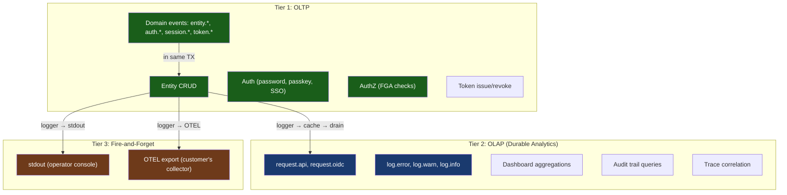

# ADR-010: Three-Tier Data Architecture

**Status**: Accepted  
**Date**: 2026-03-28  
**Builds on**: ADR-005 (Unified Data Model), ADR-006 (Entity Naming)  
**Related**: [Event Pipeline](../architecture/event-pipeline.md), [Glossary](../GLOSSARY.md), [Storage Architecture](../design/storage-architecture.md)  
**Supersedes**: Embedded DuckDB, Parquet lake_writer (both removed), original two-tier ADR

## Context

Zitadel is an identity platform that serves three distinct domains. Each has different data requirements, query patterns, latency constraints, and failure modes. This ADR defines the three-tier architecture that governs how data flows across these domains.

The later `storage.*` role model overlays this ADR rather than replacing it:

- `storage.stateful`, `storage.read`, `storage.kv`, and `storage.sink` shape transactional and transient runtime paths
- `storage.analytics` aligns analytical storage with the same config namespace
- the observability SQLite buffer remains the durable analytics ingest path in the current POC

## The Three Tiers



| Tier | What | Failure behavior | Latency | Examples |
|---|---|---|---|---|
| **1. OLTP** | Transactional domain events | Operation fails → user gets error | <10ms | `entity.created`, `auth.login_completed` |
| **2. OLAP** | Analytics via local cache buffer | Data accumulates in cache, drains when backend recovers | <1s | `request.api`, `log.error` |
| **3. Fire-and-forget** | stdout, OTEL export | Drop, move on | Best-effort | Operator console, OTEL collector |

## Tier 1: OLTP (Transactional)

Domain events (`entity.*`, `auth.*`, `session.*`, `token.*`) are written inside the same SQL transaction as the entity mutation:

```go
tx.Exec("UPDATE entities SET ... WHERE id = ?", id)
tx.Exec("INSERT INTO events (...) VALUES (...)", "entity.updated", category, ...)
tx.Commit() // both or neither
```

**Failure = user-visible error.** If the event INSERT fails, the entire transaction rolls back and the user gets an error response. This guarantees audit completeness for security-critical operations.

## Tier 2: OLAP (Durable Analytics)

High-volume telemetry (`request.*`, `log.*`) flows through the structured logging system into a **local SQLite cache** (`./data/zitadel-cache.db`), then batch-drains to the analytics backend:

```
Logger.InfoContext(ctx, "request.api", attrs...)
  → FanOutHandler
    → cacheSink → ./data/zitadel-cache.db (local SQLite, WAL mode)
      → Drainer (background goroutine, every 5s)
        → Batch INSERT into events table (analytics backend)
```

### Per-Stream Reliability Modes

Each logging stream has a configurable reliability mode:

| Mode | Behavior | Use case |
|---|---|---|
| `buffered` | Every record written to cache | Runtime logs — don't miss errors |
| `sampled` | Records written with probability `sample_rate` | Request logs — 1% of traffic is enough |
| `off` | No records written | Disable a stream entirely |

Default configuration:

```toml
[observability.streams.runtime]
sinks = ["stdout", "analytics"]
mode = "buffered"

[observability.streams.request]
sinks = ["stdout", "otel", "analytics"]
mode = "sampled"
sample_rate = 0.01  # 1% of requests

[observability.streams.event_pusher]
mode = "off"  # domain events go through emitEvent(), not the logger
```

### Local Cache

The SQLite cache is a **ring buffer** — oldest entries are trimmed when max capacity is reached:

- **Default path**: `./data/zitadel-cache.db` (under the working directory)
- **Max rows**: 50,000 (configurable via `cache_max`)
- **WAL mode**: Concurrent reads during writes
- **tmpfs compatible**: For multi-machine deployments, use tmpfs for in-memory speed
- **Disposable**: Can be deleted at any time — only buffered data is lost

### Drainer Circuit Breaker

The drainer uses a circuit breaker on the analytics backend:
- **Closed**: Batch INSERT every 5 seconds
- **Open** (5 failures): Skip drain attempts for 30 seconds — cache accumulates locally
- **Half-open**: Try one batch — if it succeeds, close the breaker

This ensures analytics backend outages never block the main application process.

## Tier 3: Fire-and-Forget

### stdout
Writes to stdout always succeed (or are silently dropped). No circuit breaker. Used by operators to tail logs.

### OTEL Export

```
Events → OTEL SDK → Customer's collector → ???
                                             ├─ Splunk
                                             ├─ Grafana
                                             ├─ Datadog
                                             ├─ S3 (compliance archive)
                                             └─ ClickHouse (customer-managed)
```

**Zitadel never reads from this path.** The customer routes OTEL data wherever they want. A circuit breaker protects the process — if the OTEL endpoint is down, records are dropped silently.

## Event Categories

Every event has a `category` column derived from its `event_type` prefix. See [Glossary](../GLOSSARY.md) for the full taxonomy:

| Category | Tier | Written by |
|---|---|---|
| `entity`, `auth`, `session`, `token` | Tier 1 (OLTP) | `emitEvent()` in TX |
| `request`, `log` | Tier 2 (OLAP) | Logger → cache → drain |
| `signal` | Tier 2 (OLAP) | OTLP ingestion |
| `threat` | Tier 1 (OLTP) | Intelligence engine |

## Analytics Backend

The analytics backend defaults to the same OLTP database. For larger deployments, customers configure a dedicated database:

```toml
[storage.analytics]
backend = "same_stateful"              # default: same DB
# backend = "postgres"                 # dedicated analytics Postgres (future)
# url = "postgres://analytics:5432/z"
# backend = "clickhouse"               # ClickHouse (future)
# url = "clickhouse://localhost:9000"
```

## Intelligence Domain

Intelligence outputs (alerts, automated rate limits, session revocations) are **also events** — they flow back into Tier 2 via Tier 1 transactions, creating a closed feedback loop:

```
Events → Threat rules (expr) → [optional: SLM classification] → Action
Action = event (threat.detected, action.session_revoked)
Action → Events table → visible in Console → queryable → traceable
```

## Consequences

- **Single Rust binary** — no separate OLAP service at Level 0. The `storage.*` runtime roles stay stable while deployments swap implementations underneath them.
- **Three clear tiers** — OLTP (critical), OLAP (durable), Fire-and-forget (disposable)
- **Local cache = zero external deps** — SQLite provides durability without Redis/Kafka
- **Configurable reliability** — operators choose buffered, sampled, or off per stream
- **Circuit breakers everywhere** — Tier 2 drainer and Tier 3 OTEL both have CBs
- **Console analytics works out of the box** — queries OLTP, zero config
- **Intelligence feeds back** — alerts and actions are events, closed loop
- **SDK telemetry enriches** — client-side data correlates with server events
