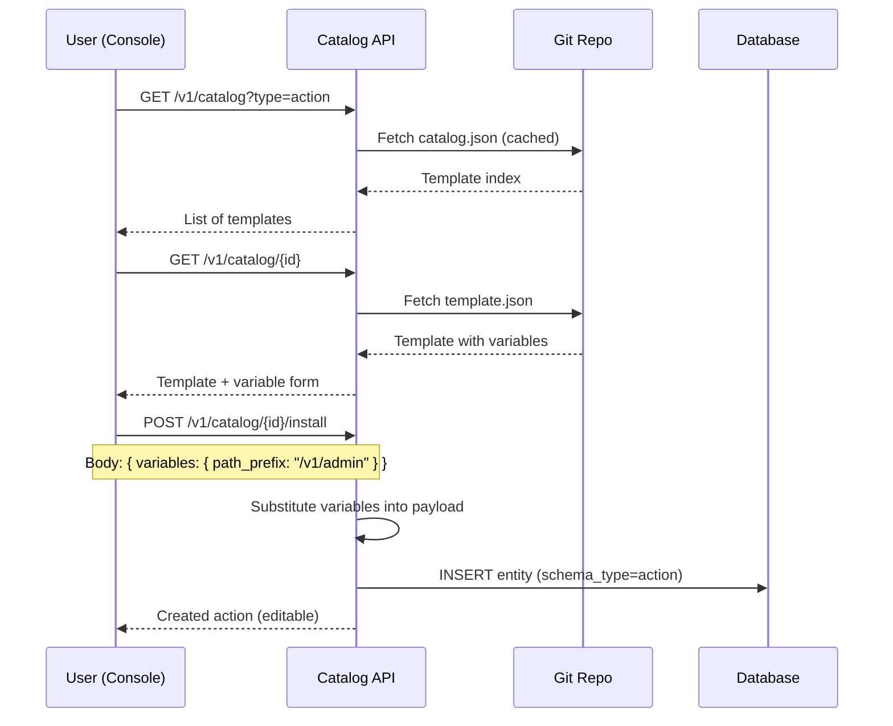
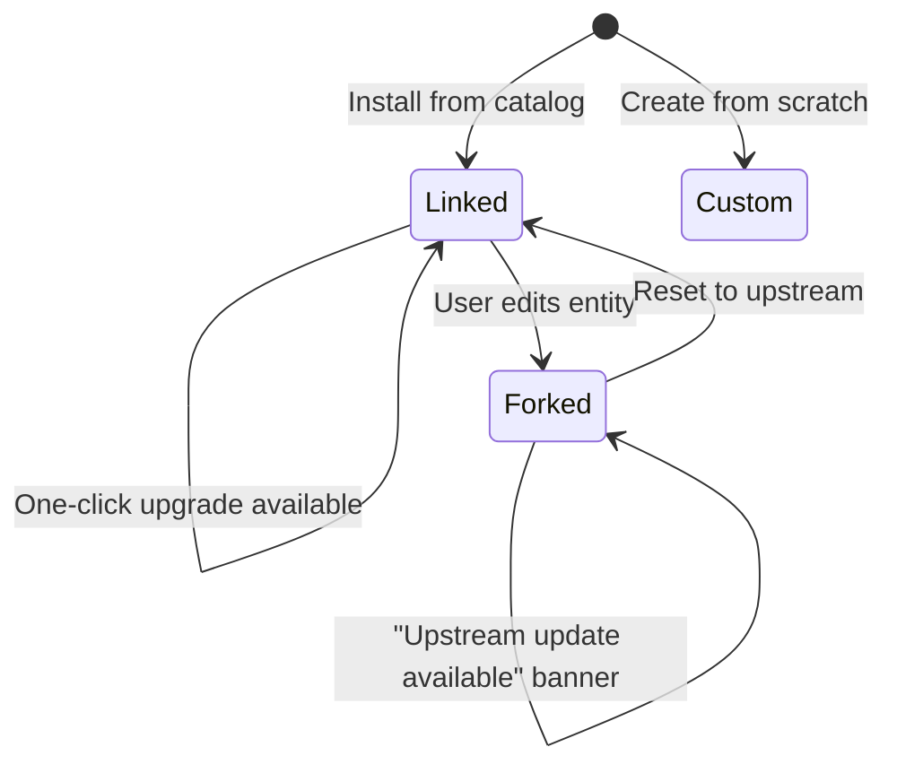
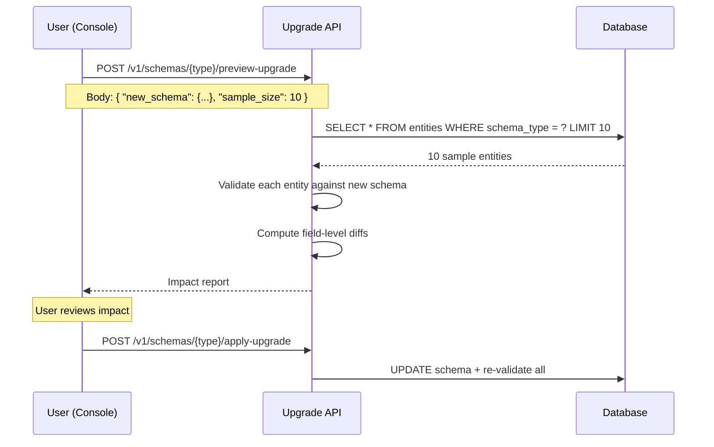

# ADR-015: Actions, Templates & Catalog

**Status**: Proposed  
**Date**: 2026-03-28  
**Builds on**: ADR-009 (Settings & Engine Pipeline), ADR-004 (Apps as Identities)

## Context

ADR-009 introduced "Rules" — expr programs bound to pipeline stages — as the extensibility mechanism for the engine pipeline. While the technical model is sound, the naming and framing limit how users think about the system:

- "Rules" sounds like internal policy enforcement, not user-facing extensibility
- There's no concept of sharing or reusing rule configurations across instances
- Identity providers (Google, Entra ID, etc.) ship with hardcoded claim mappings that should be customizable and distributable
- OpenFGA authorization models are hand-crafted per deployment with no template ecosystem

### The insight

> **Actions are the universal extensibility primitive. A catalog of templates — actions, providers, authorization models — turns Zitadel into a platform.**

## Decision

### 1. Rename: Rules → Actions

| Before | After | Why |
|---|---|---|
| Rule | **Action** | User-facing, implies "something I do" |
| Engine | **Action Type** | rate_limit, webhook, expr, captcha, risk |
| Condition | **Trigger** | expr that decides when to fire |
| Stage | **Hook** | Pipeline attachment point |
| `rule.json` | `action.json` | Schema file |
| `x-rule` | `x-action` | Annotation prefix |
| `/v1/rules` | `/v1/actions` | API path |

The data model is unchanged — an Action is still an entity with stage, condition (trigger), engine (type), and config.

### 2. Template Catalog

A **Template** is a pre-built, read-only configuration that users can browse, preview, and install. Templates live in a git repository and are indexed by a `catalog.json` manifest.

#### Template Types

| Type | What it templates | Examples |
|---|---|---|
| `action` | Pipeline actions (expr programs) | Rate limit by path, webhook on user created, block disposable emails |
| `provider` | Identity provider configs with claim mappings | Google OIDC, Microsoft Entra ID, Okta SAML, GitHub |
| `authorization` | OpenFGA authorization models | RBAC, team-based access, document sharing, SaaS multi-tenant |
| `schema` | Entity schemas with annotations | Enterprise user, B2C customer, IoT device identity |
| `login_flow` | Login experience bundles (policy + providers + branding + actions) | Passkey-first, SSO-only enterprise, B2C social login, passwordless |

#### Repository Structure

```
zitadel-catalog/
├── catalog.json                    # index manifest
├── actions/
│   ├── rate-limit-by-path/
│   │   ├── template.json           # action definition
│   │   ├── README.md               # description, screenshots
│   │   └── icon.svg
│   ├── webhook-on-user-created/
│   │   ├── template.json
│   │   └── README.md
│   ├── block-disposable-emails/
│   │   ├── template.json
│   │   ├── disposable-domains.txt  # bundled data
│   │   └── README.md
│   └── mfa-step-up-on-risk/
│       ├── template.json
│       └── README.md
├── providers/
│   ├── google-oidc/
│   │   ├── template.json           # provider config + claim mappings
│   │   └── README.md
│   ├── entra-id/
│   │   ├── template.json
│   │   └── README.md
│   └── okta-saml/
│       ├── template.json
│       └── README.md
├── authorization/
│   ├── rbac-basic/
│   │   ├── template.json           # FGA model + sample tuples
│   │   └── README.md
│   ├── team-based-access/
│   │   ├── template.json
│   │   └── README.md
│   └── saas-multi-tenant/
│       ├── template.json
│       └── README.md
├── schemas/
│   ├── enterprise-user/
│   │   ├── template.json
│   │   └── README.md
│   └── b2c-customer/
│       ├── template.json
│       └── README.md
└── login_flows/
    ├── passkey-first/
    │   ├── template.json            # login policy + auth methods + branding
    │   └── README.md
    ├── sso-enterprise/
    │   ├── template.json
    │   └── README.md
    └── b2c-social/
        ├── template.json
        └── README.md
```

#### Catalog Manifest

```json
{
  "version": "1.0",
  "templates": [
    {
      "id": "rate-limit-by-path",
      "type": "action",
      "name": "Rate Limit by Path",
      "description": "Apply different rate limits to specific API paths using expr conditions.",
      "tags": ["security", "rate-limiting", "api"],
      "version": "1.0.0",
      "author": "zitadel",
      "path": "actions/rate-limit-by-path"
    },
    {
      "id": "google-oidc",
      "type": "provider",
      "name": "Google OIDC",
      "description": "Pre-configured Google identity provider with standard claim mappings.",
      "tags": ["oidc", "social-login", "google"],
      "version": "1.0.0",
      "author": "zitadel",
      "path": "providers/google-oidc"
    },
    {
      "id": "rbac-basic",
      "type": "authorization",
      "name": "Basic RBAC",
      "description": "Role-based access control model with admin, editor, and viewer roles.",
      "tags": ["rbac", "authorization", "getting-started"],
      "version": "1.0.0",
      "author": "zitadel",
      "path": "authorization/rbac-basic"
    }
  ]
}
```

#### Template Format

Each `template.json` has a common envelope:

```json
{
  "$schema": "https://zitadel.com/schemas/v1/template",
  "type": "action",
  "version": "1.0.0",
  "name": "Rate Limit by Path",
  "description": "Apply different rate limits to specific API paths.",
  "variables": {
    "path_prefix": {
      "type": "string",
      "description": "API path prefix to rate limit",
      "default": "/v1/"
    },
    "requests_per_minute": {
      "type": "integer",
      "description": "Max requests per minute",
      "default": 100
    }
  },
  "payload": {
    "display_name": "Rate Limit: {{path_prefix}}",
    "stage": "on_request",
    "engine": "rate_limit",
    "condition": "request.path startsWith '{{path_prefix}}'",
    "config": {
      "key": "request.ip",
      "limit": "{{requests_per_minute}}",
      "window": "1m"
    }
  }
}
```

**`variables`** — user-fillable fields shown in the install wizard. The Console renders a form from this schema and substitutes `{{var}}` in the payload before creating the action entity.

### 3. Catalog Source Configuration

```toml
[catalog]
# Git repository URL for the template catalog.
# Default: official Zitadel catalog.
url = "https://github.com/zitadel/catalog"

# Local directory override (dev mode).
# When set, takes priority over url.
local_path = ""

# How often to refresh the catalog index (0 = manual only).
refresh_interval = "1h"
```

Resolution order:
1. `local_path` if set (dev/air-gapped)
2. `url` — fetch `catalog.json` via HTTP (GitHub raw content or git archive)
3. Built-in fallback — a minimal set of templates embedded in the binary

### 4. Install Flow



After installation, the action is a regular entity — fully editable in the Console's Monaco editor. The template origin is stored as metadata for update tracking.

### 5. Provider Templates

Provider templates bundle the full provider configuration including claim mappings:

```json
{
  "type": "provider",
  "name": "Microsoft Entra ID",
  "variables": {
    "tenant_id": { "type": "string", "description": "Azure AD Tenant ID" },
    "client_id": { "type": "string", "description": "Application (client) ID" },
    "client_secret": { "type": "string", "description": "Client secret", "sensitive": true }
  },
  "payload": {
    "display_name": "Microsoft Entra ID",
    "type": "oidc",
    "issuer": "https://login.microsoftonline.com/{{tenant_id}}/v2.0",
    "client_id": "{{client_id}}",
    "client_secret": "{{client_secret}}",
    "scopes": ["openid", "profile", "email"],
    "claim_overrides": {
      "email": "claims.preferred_username ?? claims.email ?? claims.upn",
      "display_name": "claims.name",
      "first_name": "claims.given_name",
      "last_name": "claims.family_name"
    }
  }
}
```

This eliminates the "which claims does Entra ID use?" problem entirely. Users install the template, enter their tenant credentials, and claim mapping just works.

### 6. Authorization Model Templates

FGA model templates bundle the authorization model and optionally sample tuples:

```json
{
  "type": "authorization",
  "name": "SaaS Multi-Tenant",
  "description": "Organization-scoped RBAC with tenant isolation.",
  "payload": {
    "model": "model\n  schema 1.1\n\ntype organization\n  relations\n    define admin: [user]\n    define member: [user] or admin\n\ntype document\n  relations\n    define org: [organization]\n    define owner: [user]\n    define editor: [user] or owner\n    define viewer: [user] or editor or member from org",
    "sample_tuples": [
      { "user": "user:alice", "relation": "admin", "object": "organization:acme" },
      { "user": "organization:acme", "relation": "org", "object": "document:readme" }
    ]
  }
}
```

### 7. Template Lifecycle

Installed templates evolve through three states:



| State | Description | Upgrade behavior |
|---|---|---|
| **Linked** | Installed from catalog, unmodified | Auto-upgradeable (patch versions) or one-click (major). Content hash matches origin. |
| **Forked** | Installed from catalog, then edited by user | Show "upstream update available" banner with diff view. Manual review + merge. |
| **Custom** | Created from scratch (no catalog origin) | No upstream tracking. Full user ownership. |

**State detection** — On every entity save, compare `sha256(data)` against the `installed_hash`. If they diverge → state flips from `linked` to `forked`. This is computed, not stored (no drift between stored state and reality).

**Upgrade strategies:**

| Scenario | Strategy |
|---|---|
| Linked entity, patch update (1.0.0 → 1.0.1) | Auto-apply if `auto_upgrade` is enabled in settings |
| Linked entity, minor/major update (1.0 → 2.0) | Show changelog + diff, one-click apply |
| Forked entity, any update | Show three-pane diff (original ↔ upstream ↔ yours), user merges |
| Forked entity, reset | Replace content with latest upstream, recalculate hash → becomes `linked` |

### 8. Origin Tracking

Every entity installed from the catalog carries a `_catalog` metadata block:

```json
{
  "display_name": "Google OIDC",
  "type": "oidc",
  "issuer": "https://accounts.google.com",
  "...": "...",

  "_catalog": {
    "template_id": "google-oidc",
    "template_version": "1.0.0",
    "installed_at": "2026-03-28T09:35:00Z",
    "installed_hash": "sha256:e3b0c44298fc...",
    "upstream_version": "1.1.0",
    "auto_upgrade": false
  }
}
```

| Field | Purpose |
|---|---|
| `template_id` | Which catalog template this was installed from |
| `template_version` | Version at time of installation |
| `installed_at` | When the template was installed |
| `installed_hash` | SHA-256 of the original payload (before any edits) |
| `upstream_version` | Latest version available in catalog (updated on refresh) |
| `auto_upgrade` | Whether to auto-apply patch updates |

The `_catalog` block is:
- **Set** on install (`POST /v1/catalog/{id}/install`)
- **Preserved** on user edits (user edits `data`, `_catalog` metadata stays)
- **Updated** by the catalog refresh loop (`upstream_version` field)
- **Removed** if the user explicitly "detaches" the entity from catalog tracking

**State is derived, not stored.** To check state:
```
if _catalog is absent        → Custom
if sha256(data) == installed_hash → Linked
else                         → Forked
```

### 9. Console UI Architecture

The catalog experience is **split across two views**: Marketplace for browsing/installing, Schemas for admin.

```
Console Nav
│
├── Schemas                          ← ADMIN tool (System section)
│   ├── Schema type cards            — human_user, action, provider, etc.
│   │   └── [schema card]           — view/edit JSON schema, version history
│   ├── [+ New Schema Type]         — create blank schema
│   └── [Browse Marketplace →]      — links to /marketplace
│
├── Marketplace                      ← CATALOG browser (own section)
│   ├── Filter: [All] [Actions] [Providers] [Authorization] [Schemas] [Login Flows]
│   ├── Search: [________________]
│   ├── [Refresh]                   — re-fetch from git source
│   └── [template card]            — name, desc, tags, type badge, [Install]
│       └── Install dialog         — variable form, one-click install
│
├── Actions                          ← RESOURCE view
│   ├── My Actions                   — installed actions
│   │   ├── [action card]            — toggle, edit (Monaco), state badge
│   │   └── origin: "from catalog: Rate Limit by Path v1.0.0" (if applicable)
│   └── [+ New Action]
│       ├── [Blank]                  — Monaco editor, empty
│       └── [From Marketplace →]     — opens marketplace filtered to type=action
│
├── Providers                        ← RESOURCE view
│   ├── My Providers                 — configured providers
│   │   ├── [provider card]          — status, origin badge
│   │   └── origin: "from catalog: Google OIDC v1.0.0"
│   └── [+ New Provider]
│       ├── [Custom OIDC]            — manual config
│       ├── [Custom OAuth]           — manual config
│       └── [From Marketplace →]     — marketplace filtered to type=provider
│
├── Authorization                    ← RESOURCE view
│   ├── My Models                    — installed FGA models
│   │   └── origin: "from catalog: Basic RBAC v1.0.0"
│   └── [+ New Model]
│       ├── [Blank]                  — DSL editor
│       └── [From Marketplace →]     — marketplace filtered to type=authorization
│
└── Settings
    └── Catalog Source               — URL, local path, refresh interval
```

**Key UX principles:**

1. **Marketplace is the shopping experience** — browse templates, filter by type, search, one-click install
2. **Schemas is the admin tool** — schema type definitions, version management, JSON Schema editing
3. **Resource views are contextual** — show only what's relevant, "From Marketplace" is a progressive disclosure button
4. **Origin badges everywhere** — every entity installed from catalog shows its origin, version, and state (linked/forked)
5. **One-click providers** — the marketplace turns provider setup from "OIDC configuration + claim mapping puzzle" into "enter credentials → done"
6. **Upgrade notifications** — when a catalog refresh finds newer versions, show a badge count on the Marketplace nav item


### 10. Catalog API Extensions

To support lifecycle, the API gains new endpoints:

```
GET    /v1/catalog/{id}/changelog      — Version history + diffs for a template
POST   /v1/catalog/{id}/check-upgrade  — Compare installed entity with latest upstream
POST   /v1/catalog/{id}/upgrade        — Apply upgrade (linked only, or force)
POST   /v1/catalog/{id}/detach         — Remove _catalog tracking from entity
GET    /v1/entities?catalog_state=forked — Filter entities by catalog state
```

### 11. Login Flow Templates

Login flows are first-class catalog entries. A login flow template bundles **everything** needed for a complete authentication experience:

```json
{
  "type": "login_flow",
  "version": "1.0.0",
  "name": "Passkey-First",
  "description": "Modern passwordless login with passkeys as the primary method, password as fallback.",
  "variables": {
    "primary_color": {
      "type": "string",
      "description": "Brand color for the login screen",
      "default": "#6366f1"
    },
    "allow_registration": {
      "type": "boolean",
      "description": "Allow self-registration",
      "default": true
    }
  },
  "payload": {
    "display_name": "Passkey-First Login",
    "login_policy": {
      "preset": "passkey_first",
      "passwordless_enabled": true,
      "mfa_required": false,
      "registration_allowed": "{{allow_registration}}"
    },
    "auth_methods": {
      "passkey":  { "enabled": true, "position": 0 },
      "password": { "enabled": true, "position": 1 },
      "sso":      { "enabled": true, "position": 2 }
    },
    "branding": {
      "heading": "Sign in",
      "colors": { "primary": "{{primary_color}}" }
    },
    "actions": [
      {
        "template_id": "block-disposable-emails",
        "variables": {}
      }
    ]
  }
}
```

A login flow template can **reference other catalog templates** (e.g., bundling a `block-disposable-emails` action). On install, these are resolved transitively.

**What makes login flows different from other template types:**

| Aspect | Other Templates | Login Flows |
|---|---|---|
| Output | Single entity | Multiple related entities (policy + actions + branding) |
| Schema interaction | None | Modifies `x-login`, `x-auth-methods`, `x-branding` annotations on the identity schema |
| Composable | Standalone | Can bundle other templates (actions, providers) |
| Preview | Standard diff | Shows how the login screen would look + which users are affected |

### 12. Schema Upgrade Preview (Impact Analysis)

When upgrading a schema (from catalog or manual edit), users need to understand the blast radius before committing. The **upgrade preview** shows entity-level impact.



#### Impact Report Format

```json
{
  "schema_type": "human_user",
  "current_version": "1.0",
  "new_version": "2.0",
  "total_entities": 1523,
  "sampled": 10,
  "impact": {
    "valid": 8,
    "warnings": 1,
    "breaking": 1
  },
  "field_changes": [
    {
      "path": "properties.phone",
      "change": "required_added",
      "description": "phone is now required but was optional",
      "affected_estimate": 340,
      "severity": "breaking"
    },
    {
      "path": "properties.mfa_preference",
      "change": "field_added",
      "description": "New optional field with default 'prompt'",
      "affected_estimate": 0,
      "severity": "info"
    }
  ],
  "sample_entities": [
    {
      "id": "usr_abc123",
      "display_name": "Alice Smith",
      "status": "valid",
      "changes": []
    },
    {
      "id": "usr_def456",
      "display_name": "Bob Jones",
      "status": "breaking",
      "changes": [
        {
          "path": "phone",
          "issue": "required field missing",
          "current_value": null,
          "suggestion": "Set default or make field optional"
        }
      ]
    }
  ]
}
```

**Key features:**

1. **Sample-based preview** — Validate against a configurable sample (10 by default) rather than all entities. Extrapolate impact.
2. **Per-entity diff** — Show each sampled entity with its specific issues: "Bob Jones would break because phone is missing."
3. **Field-level classification** — `info` (new optional), `warning` (new default applies), `breaking` (validation would fail).
4. **Affected estimate** — `COUNT(*)` for each breaking change to show blast radius before committing.
5. **Suggestions** — Actionable remediation hints: "Set default or make field optional."

#### Upgrade strategies the user can pick:

| Strategy | Behavior | Use case |
|---|---|---|
| **Strict** | Apply only if 0 breaking changes | Production schemas |
| **Migrate** | Apply + set defaults for missing required fields | Adding new required fields |
| **Force** | Apply regardless, mark invalid entities | Development / staging |

## Consequences

- **Actions replace Rules** — same data model, better framing, user-facing extensibility
- **Templates are distribution** — git-backed, community-contributable, no registry infrastructure
- **Providers become installable** — no more manual claim mapping for common IdPs
- **FGA models become shareable** — authorization patterns as reusable templates
- **Login flows become packageable** — entire auth experience as a single template: policy + providers + branding + actions
- **Monaco is the editor** — expr programs authored in-browser with autocompletion
- **Variables enable customization** — templates are parameterized, not copy-paste
- **Catalog is optional** — the system works without it; templates are convenience, not dependency
- **Lifecycle is git-like** — linked (tracking upstream), forked (diverged, diff available), custom (standalone)
- **Origin is always tracked** — `_catalog` metadata block carries provenance through the entity's entire lifetime
- **Schema upgrades are safe** — preview shows entity-level impact before committing, with sample-based blast radius estimation
- **Schemas is the command center** — centralized lifecycle management, resource views are contextual
- **Embedded-first reliability** — binary ships with templates, remote is additive, never blocks startup
