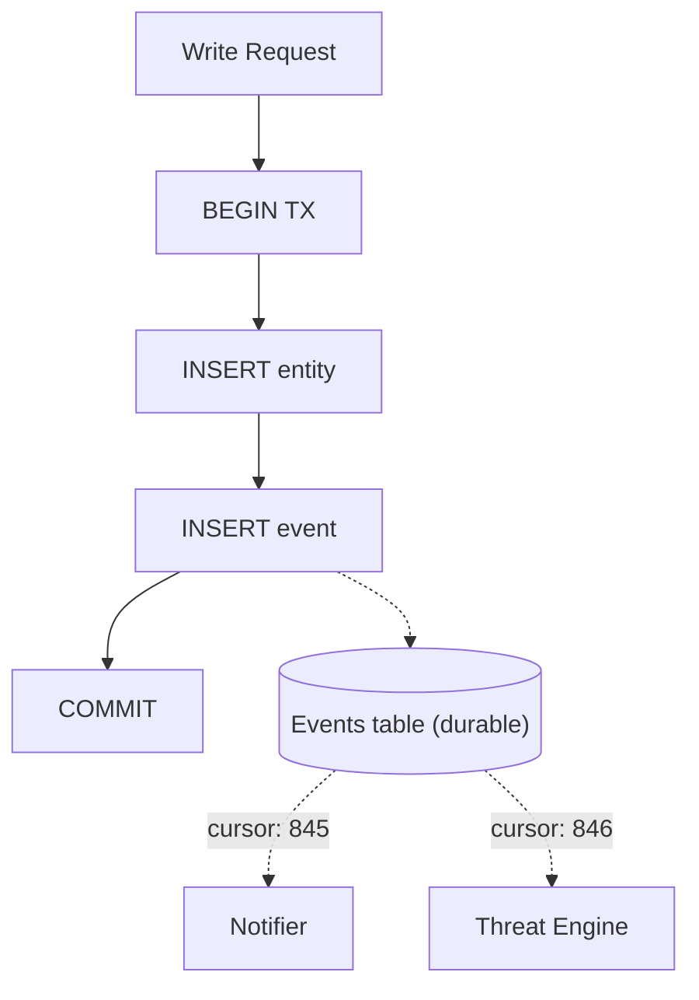
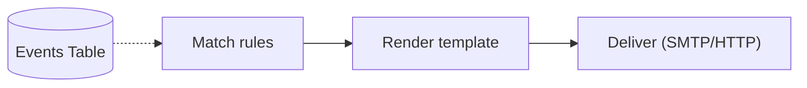
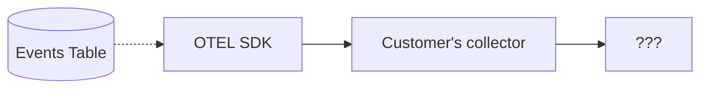
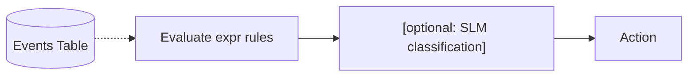
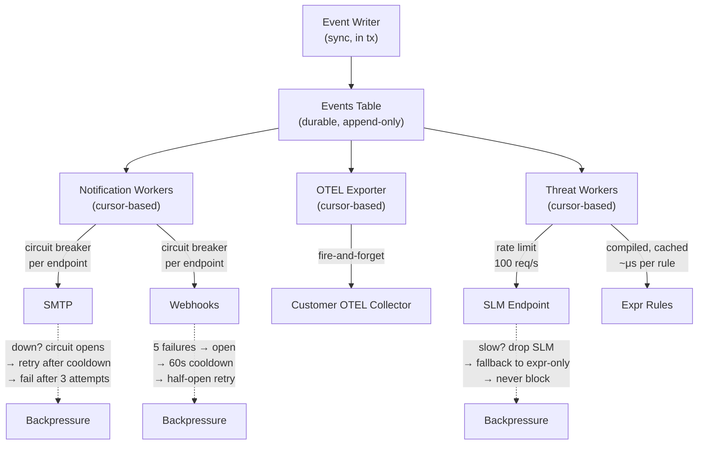

# Event Pipeline & Async Processing

## Core Principle: The Events Table IS the Queue



Events are persisted in the same SQL transaction as the entity write. Each async consumer maintains a **cursor** (last processed event ID) in the database. If Zitadel crashes, consumers resume from their cursor on restart. Zero event loss.

## Notify Channel (Not a Data Channel)

An in-memory Go channel signals consumers that new events exist — it does NOT carry the events themselves:

```go
type EventBus struct {
    // Non-blocking signal that new events exist.
    notify chan struct{}
    
    // Each consumer has a cursor persisted in DB.
    consumers map[string]*Consumer
}

// After COMMIT, signal consumers:
func (b *EventBus) Signal() {
    select {
    case b.notify <- struct{}{}: // wake up consumers
    default: // channel full, consumers already awake — skip
    }
}
```

If the signal is lost (crash), consumers poll on an interval as fallback. This gives crash-safe delivery with sub-millisecond latency for the common path.

## Async Consumers

### 1. Notification Workers (SMTP + Webhooks)



- Configurable worker pool (1-16 goroutines)
- Per-endpoint circuit breaker (5 failures → open → 60s cooldown → half-open retry)
- Retry with exponential backoff (immediate → 10s → 60s → mark FAILED)
- SMTP connection pool (1-5 concurrent)

### 2. OTEL Exporter (Fire-and-Forget)



Zitadel emits events as OpenTelemetry log records. The customer's OTEL collector routes them wherever they want (Splunk, Grafana, ClickHouse, S3). Zitadel never reads from this path. See [ADR-010](../010-analytics-two-tier.md).

### 3. Threat Workers (Future — expr Rules + SLM)



- Threat workers run in a separate pool from notifications
- `expr` rules are compiled once and cached — evaluation is ~μs per rule
- SLM calls are HTTP to an external endpoint — circuit breaker applies
- Shadow mode: evaluate + log, no action (safe to run at full speed)
- SLM is never in the critical path — it's async enrichment

## Backpressure Summary



## Why Not an External Queue?

| Option | Pros | Cons |
|---|---|---|
| **SQL events table (chosen)** | Already persisted, crash-safe, zero new deps | Polling latency (~ms, mitigated by notify channel) |
| **Ring buffer (in-memory)** | Ultra-fast | Loses events on crash, fixed size |
| **Redis streams** | Fast, persistent | New dependency, operational overhead |
| **Kafka / NATS** | Enterprise-grade, partitioned | Massive new dependency, defeats single-binary goal |

The events table + notify channel gives us crash-safe delivery with sub-millisecond latency. No new dependencies. The single-binary promise stays intact.

## Event Schema

Every event follows a consistent envelope:

```json
{
  "id": "01JNQWX...",
  "type": "entity.created",
  "org_id": "org_abc",
  "actor_id": "identity_xyz",
  "aggregate_id": "identity_new123",
  "aggregate_type": "identity",
  "timestamp": "2026-03-25T20:24:00Z",
  "payload": {
    "identifier": "alice@acme.com",
    "display_name": "Alice"
  },
  "metadata": {
    "ip": "203.0.113.42",
    "user_agent": "Mozilla/5.0...",
    "geo": "US-CA"
  }
}
```

## Event Types

| Category | Event Types |
|---|---|
| **Auth** | `auth.session.created`, `auth.session.revoked`, `auth.password.succeeded`, `auth.password.failed`, `auth.passkey.succeeded`, `auth.magic_link.sent` |
| **Entity** | `entity.created`, `entity.updated`, `entity.deleted` |
| **Token** | `token.issued`, `token.refreshed`, `token.revoked`, `token.introspected` |
| **Schema** | `schema.created`, `schema.updated`, `schema.deleted` |
| **Org** | `org.created`, `org.updated`, `org.domain.added`, `org.domain.verified` |
| **Notification** | `notification.sent`, `notification.failed`, `notification.retried` |
| **Threat** | `threat.detected`, `threat.classified`, `threat.action.executed` |

## Configuration

```toml
[workers]
# Notifications
notification_workers = 2      # concurrent notification goroutines
notification_max_attempts = 3
notification_max_ttl = "5m"

# Webhooks
webhook_timeout = "10s"
webhook_circuit_max_failures = 5
webhook_circuit_cooldown = "60s"

# SMTP
smtp_pool_size = 2
smtp_timeout = "30s"

# Threat (future)
threat_workers = 1
threat_slm_rate_limit = 100   # req/s to SLM endpoint
threat_slm_timeout = "5s"
```
