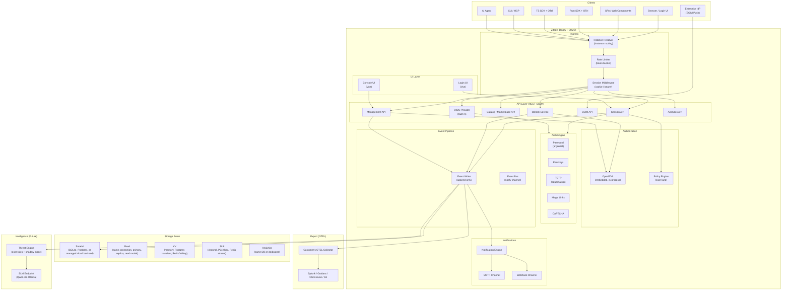
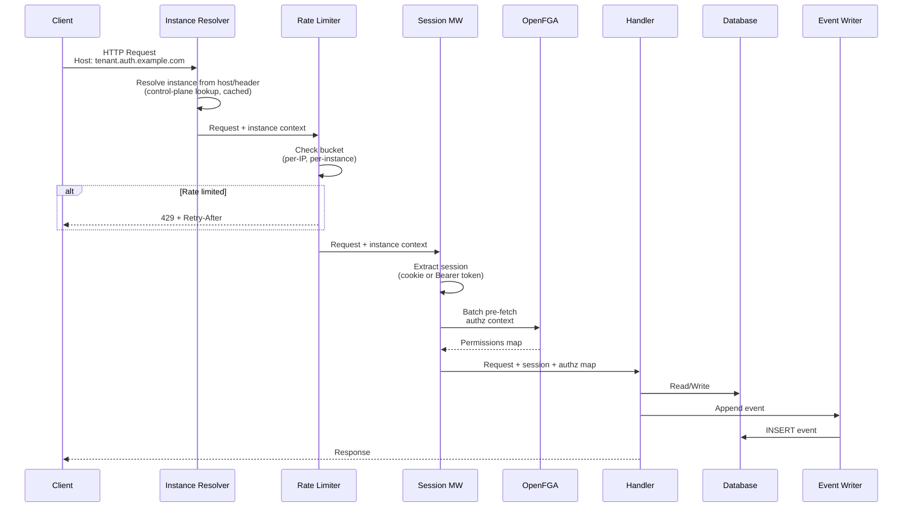
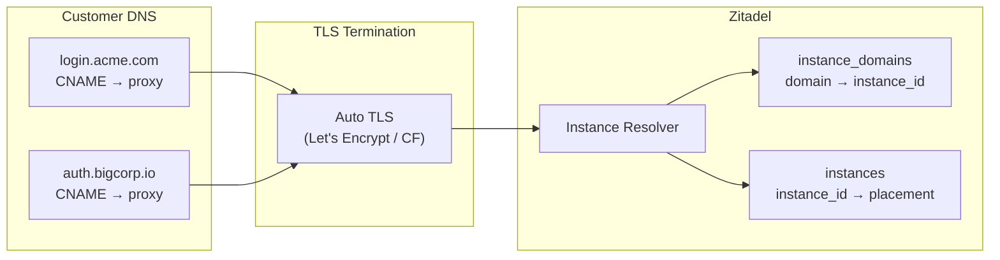

# System Architecture

Zitadel is a single Rust binary that bundles authentication, authorization, user and application management, and observability. At Level 0 (local/SQLite), everything runs in one process with zero external dependencies. As deployments scale, the same binary keeps the same storage roles and swaps implementations underneath them. See [Storage Architecture](../design/storage-architecture.md) for the canonical `storage.*` model.

## High-Level Architecture

## Three Domains

Zitadel serves three distinct domains, each with different data requirements:

| Domain | Purpose | Latency | Examples |
|---|---|---|---|
| **Transactional** | CRUD, auth, authz | <10ms | Create user, authenticate, check permissions |
| **Analytical** | Aggregation, audit, traces | <1s | Login trends, audit trail, "what did user X do?" |
| **Intelligence** | Detection, alerting, response | Async | Anomaly detection, automated rate limiting |

See [ADR-010](../adr/010-three-tier-data.md) for the full data flow across these domains.

## Public API Model

- Public APIs use concrete family nouns such as `/v1/users`, `/v1/apps`, and `/v1/orgs`.
- `users` is a typed family for `human_user`, `service_user`, and `ai_agent`.
- `apps` is a typed family for application schemas.
- `schema_id` is the canonical write-time discriminator in request bodies.
- `schema_type` is the canonical read/filter discriminator on family list endpoints.
- `entity` remains an internal architecture term used for storage and schema-engine reasoning.

## Request Pipeline

### Pipeline Rules

1. **Single transaction for authoritative retained facts** — entity write + retained domain event append happen in ONE authoritative transaction. If either fails, both roll back.
2. **FGA is pre-fetched** — authorization context batch-loaded BEFORE handler execution. Zero live FGA calls during request.
3. **Response before async** — client gets a response immediately after DB commit. Notifications and threat evaluation happen asynchronously.
4. **Events drive everything** — notifications, OTEL export, and threat detection all consume from the events table.
5. **Session provenance is persisted** — when available, sessions and auth events record `auth_method`, `provider_id`, `provider_kind`, and `login_flow_id`.
6. **Regional auth continuity is allowed** — not every login must synchronously depend on a central control-plane write path; transient regional auth state may flow through `read`, `kv`, and `sink`.

## External Domain Handling

**Resolution priority** (from request Host header):
1. Self-hosted single-instance mode → configured/default local `instance_id`
2. Trusted header: `X-Zitadel-Instance: instance_id` → direct override from trusted proxies only
3. Exact match in `instance_domains` → `instance_id`
4. Unknown host in cloud mode → request rejected

The authoritative routing data is portal-managed control-plane state. The runtime keeps an in-process LRU/TTL cache, but `instance_id` resolution is still driven by the `instances` and `instance_domains` tables.

## Deployment Topologies

The system uses one role-based storage runtime with different defaults by operating mode. Most operators only configure `storage.stateful`; the runtime derives `read`, `kv`, `sink`, `process_cache`, and `analytics`. See [Storage Architecture](../design/storage-architecture.md) for full details.

| Mode | Primary backend | Instance model | Placement |
|---|---|---|---|
| **Small self-hosted** | SQLite | One instance per deployment | Local operator-managed |
| **Enterprise self-hosted** | Postgres | One instance per deployment | Operator-managed |
| **ZITADEL Cloud** | Managed cloud backend selected by `backend_key` | Many instances routed by the control plane | `global` or `regional` via control-plane placement |

For cloud, the request resolver returns `instance_id`, `customer_id`, `placement_mode`, `region_key`, and `backend_key` before auth/session middleware runs. The binary reaches the control plane via `cloud.control_plane`, then reads `instances`, `instance_domains`, and `cloud_backends` to resolve the live backend binding. Specific backend choice is intentionally left open between shared-schema and regional managed-backend topologies.

## Planes And Consistency Classes

The architecture separates the management side of the system from the end-user auth runtime.

| Consistency class | Typical examples | Default behavior |
|---|---|---|
| **Strong / control-plane authoritative** | user creation, provider config, policy edits, placement changes | writes go to the authoritative plane; if unavailable, the mutation fails |
| **Bounded eventual / auth continuity** | session creation, login runtime state, auth request progress, regional auth projections | regional auth may continue; state lands in `storage.kv` and is reconciled via `storage.sink` |
| **Freshness-critical / priority path** | disable user, logout-all, token or session revocation, factor removal, emergency policy changes | use a priority invalidation path; if freshness cannot be proven within budget, fail closed |

This is why the storage-role split exists even when multiple roles may map to the same physical backend in small deployments.

## Degraded-Mode Defaults

The design goal is explicit: brief control-plane outages are acceptable, and login continuity is more important than immediate admin mutation availability.

| Operation | Planned maintenance | Unplanned central outage |
|---|---|---|
| **New login** | allowed after control-plane writes are frozen and regional reads are known-good | allowed with bounded stale-data risk through regional read models plus `kv + sink` |
| **Existing session validation** | allowed regionally | allowed regionally |
| **Control-plane mutation** | blocked until the authoritative plane returns | blocked until the authoritative plane returns |
| **Revocation / disable / logout-all** | routed through the priority invalidation path; if freshness budget is not met, fail closed | routed through the priority invalidation path; if freshness budget is not met, fail closed |

## Provider / Flow / Session Boundaries

- **Provider**: connection settings, inbound claim mapping, target schema, and linking rules
- **Login Flow**: user-facing UX plus which providers are visible for that flow
- **Session**: created auth state with provenance about which flow and provider produced it
