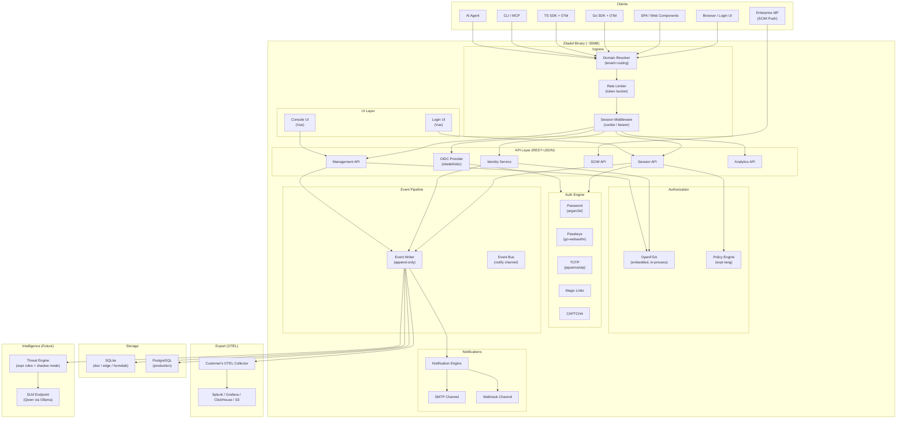
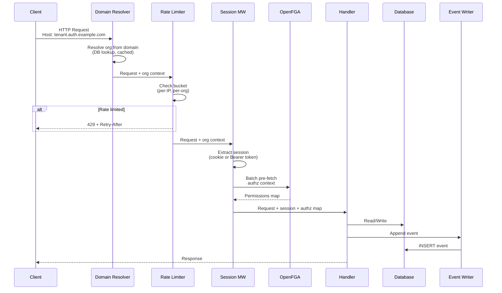
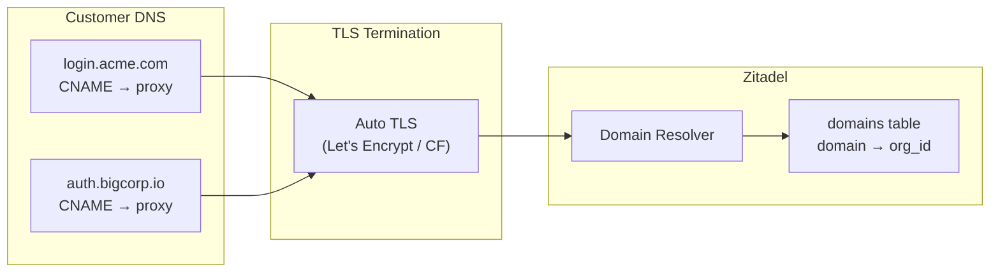

# System Architecture

Zitadel is a single Go binary (~30MB) that bundles authentication, authorization, identity management, and observability into one process.

## High-Level Architecture

## Three Domains

Zitadel serves three distinct domains, each with different data requirements:

| Domain | Purpose | Latency | Examples |
|---|---|---|---|
| **Transactional** | CRUD, auth, authz | <10ms | Create user, authenticate, check permissions |
| **Analytical** | Aggregation, audit, traces | <1s | Login trends, audit trail, "what did user X do?" |
| **Intelligence** | Detection, alerting, response | Async | Anomaly detection, automated rate limiting |

See [ADR-010](../adr/010-three-tier-data.md) for the full data flow across these domains.

## Request Pipeline

### Pipeline Rules

1. **Single transaction** — entity write + event append in ONE database transaction. If either fails, both roll back.
2. **FGA is pre-fetched** — authorization context batch-loaded BEFORE handler execution. Zero live FGA calls during request.
3. **Response before async** — client gets a response immediately after DB commit. Notifications and threat evaluation happen asynchronously.
4. **Events drive everything** — notifications, OTEL export, and threat detection all consume from the events table.

## External Domain Handling

**Resolution priority** (from request Host header):
1. Exact match in `domains` table → org found
2. Subdomain matching: `acme.zitadel.cloud` → strip suffix → look up org
3. Header-based: `X-Zitadel-Org: org_id` → direct (API clients)
4. Default org (single-tenant mode)

## Deployment Topologies

| Target | Database | Storage |
|---|---|---|
| **Dev / Homelab** | SQLite (WAL mode) | Local filesystem |
| **Production** | PostgreSQL (primary + replicas) | Postgres |
| **Cloud** | PostgreSQL (per-region) | Postgres |
